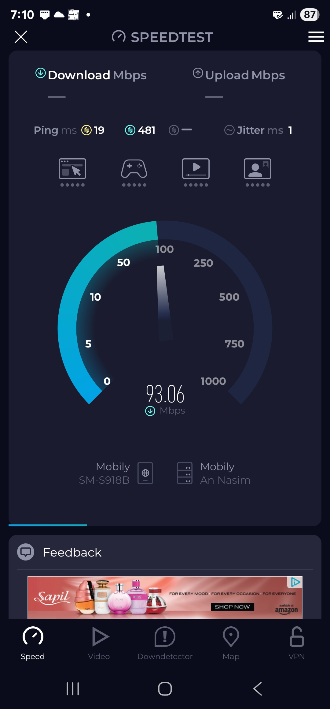
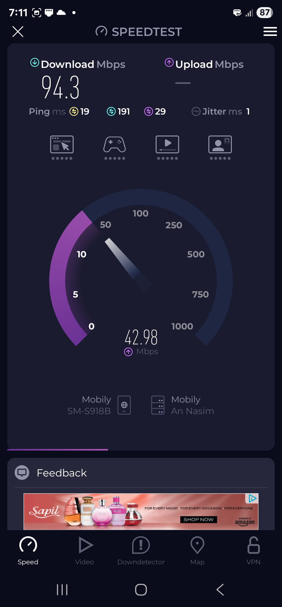

# Home Ethernet Network Upgrade

This project documents the full process of upgrading a home's internal Ethernet wiring using existing satellite conduits, wall-mounted keystones, and an unmanaged switch. The goal was to restore reliable, wired connectivity across rooms and verify performance through live testing.

---

## Project Summary

- **Objective:** Extend wired network access to multiple rooms using CAT6 cabling and RJ45 wall plates.
- **Conduits Used:** Repurposed satellite TV cable conduits (junction box-based drop).
- **Switch:** UGREEN 5-Port Gigabit Unmanaged Ethernet Switch (connected to a 5G router as the uplink).
- **Cable Type:** CAT6 UTP.
- **Termination:** RJ45 plug and keystone punch-down.
- **Validation:** Physical connection testing and speed benchmark via USB-C to Ethernet on smartphone.

---

## Tools Used

- RJ45 crimping tool  
- Punch-down tool  
- Wire stripper  
- Keystone jacks  
- Wall plates  
- Ethernet cable tester  
- USB-C to Ethernet adapter  
- Smartphone for validation

---

## Notes

- All installations reused legacy coaxial conduits, avoiding new wall drilling.  
- Static IP assignments reserved in DHCP for structured topology (future).  
- Ethernet performance verified with Speedtest app under real-world load.

---

## Photo Log

### 1. Removal of Old Wall Plate

Initial step involved removing an old faceplate to expose the wall conduit used for coaxial cabling. This conduit was reused for running the Ethernet line.

---

### 2. Keystone Jack Prepared and Aligned with Wall Plate

A CAT6-compatible keystone jack was aligned with the modular wall plate. This type of setup enables a clean and standardized RJ45 interface for in-wall Ethernet drops.

---

### 3. Wire Separation and Pair Positioning

The twisted pairs were untwisted and aligned according to the T568B wiring standard before punch-down termination.

---

### 4. Punch-Down Termination of Keystone Jack

Using a punch-down tool, wires were secured into the keystone.  
*A rubber RJ45 boot is visible in this image — cannot recall why it was included here.*

---

### 5. Keystone Fully Connected to the Wall Plate

Once wired, the keystone was clipped securely into the wall plate.

---

### 6. Wall Plate Screwed into Position

The wall plate was mounted back onto the junction box. Painting and drywall marks from previous installation are visible.

---

### 7. Final Appearance After Installation

A clean, finished wall plate with Ethernet port is now available for use.

---

### 8. Central Drop to Unmanaged Switch

All room drops converge at a central junction where they are patched into an unmanaged UGREEN 5-Port Gigabit switch. The switch uplinks to the 5G router, providing gigabit Internet across endpoints.

---

### 9. Patch Cable Fabricated for Testing

A patch cable was crimped using the T568B standard and verified using a cable tester. This cable was used for endpoint testing and validation.

---

### 10. Ethernet-to-USB-C Adapter in Use for Smartphone Testing

The phone was connected via USB-C to Ethernet adapter using the newly installed line.

---

### 11–12. Speed Test Results (Phone Over Ethernet)

Live benchmark results show stable 90+ Mbps download throughput on the phone using the wired connection—validating full operational status of the Ethernet drop.

---

