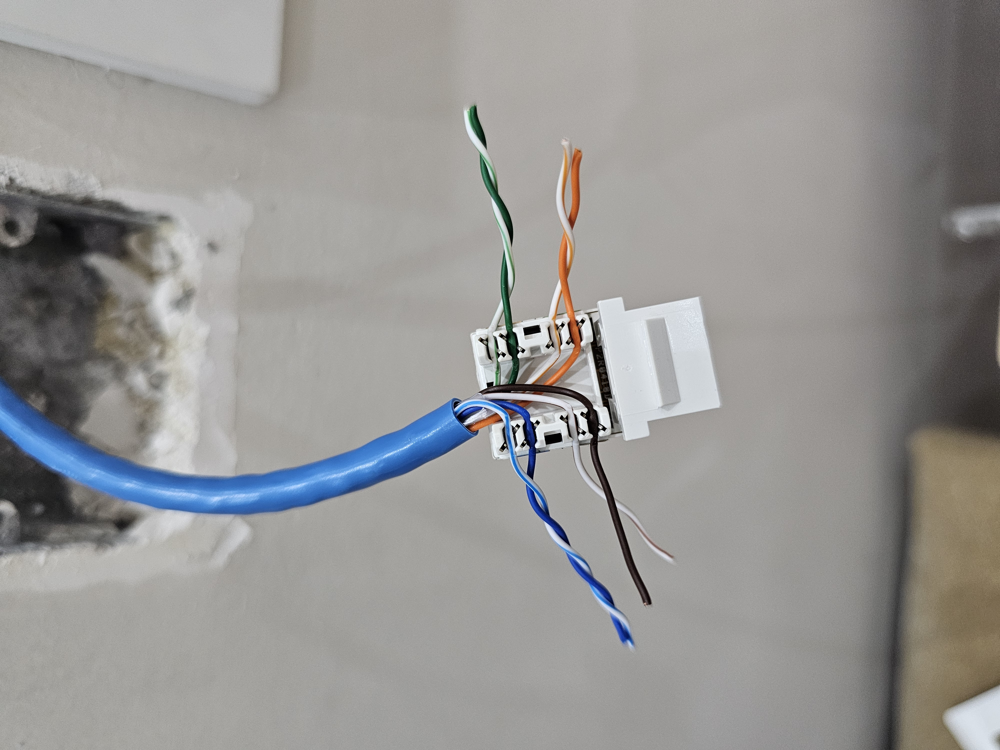
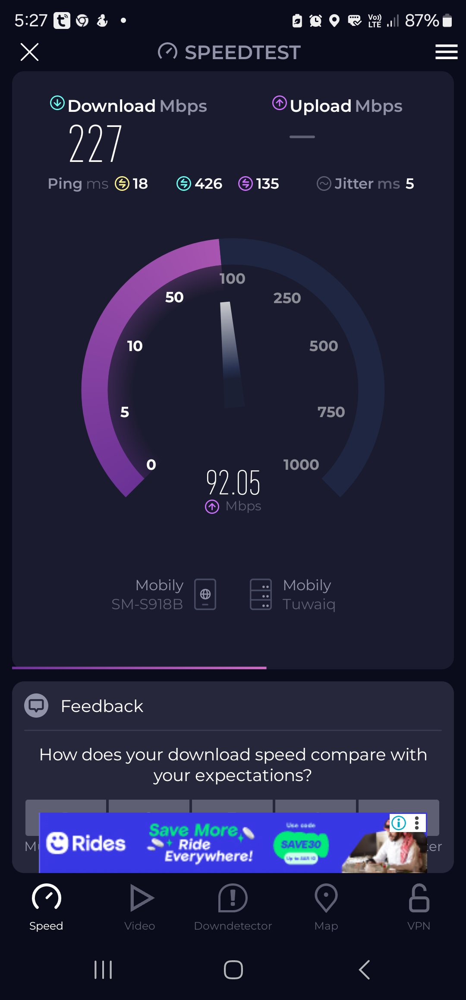

# Project Home Network – Structured Cabling and Wall Plate Installation

This project documents the process of installing structured Ethernet cabling and keystone wall plates to extend wired connectivity throughout the home. The goal was to provide fast and stable LAN access across multiple rooms using existing wall conduits.

---

## Objectives

- Extend Ethernet access to multiple rooms using wall plates
- Reuse existing satellite cable conduits to run Cat6 cable
- Terminate cleanly with keystone jacks and RJ45 plugs
- Validate with tester and real-world speed tests

---

## Tools and Materials Used

- Cat6 Ethernet bulk cable
- RJ45 plugs and Cat6 keystone jacks
- Wall plate mounting brackets
- Punchdown tool
- RJ45 crimper and cable stripper
- Ethernet cable tester
- USB-C to Gigabit Ethernet adapter (for speed tests)
- **UGREEN 5-Port Gigabit Ethernet Switch** (Unmanaged)
- **5G router** – providing uplink to the switch

---

## Conduit and Cabling Notes

- **Wiring standard:** T568B on all terminations
- Cables routed through existing **cable TV conduits**, avoiding new drilling
- Room ends terminated with RJ45 plugs; wall outlets terminated with keystone jacks

---

## Installation and Testing Steps

1. Pulled cable through the junction boxes and wall conduits
2. Crimped room-side RJ45 plugs
3. Punched down wall-side keystone jacks and installed plates
4. Verified pinouts using Ethernet cable tester
5. Connected all drops to **UGREEN unmanaged switch**
6. Uplinked switch to 5G router
7. Validated performance via real-world speed tests from each room

---

## Troubleshooting and Lessons Learned

- **Pin 2 missing**: traced to misaligned crimp; fixed by re-crimping plug
- **Loose pin 5**: resolved by reseating punchdown at the keystone
- **Second wall plate**: multiple pin failures, all resolved by redoing both ends
- **Lesson:** Cable tester is essential before mounting plates

---

## Final Results

- All installed wall plates passed tester validation
- Clean signal across all lines; no loose pins or miswires
- Achieved **~220 Mbps download / 14 Mbps upload** from Room 4 via phone adapter
- Neatly centralized at stairwell junction with visible switch layout

---

## Photos

1. **Wall routing and initial crimping**  
   

2. **Punchdown into keystone**  
   

3. **RJ45 crimp and layout**  
   

4. **Keystone jack and tester connected**  
   

5. **Punchdown close-up**  
   

6. **Cable management and testing prep**  
   

7. **Tester alignment check**  
   

8. **Final test before wall mount**  
   

9. **Keystone seated into plate**  
   

10. **Wall-mounted port testing**  
    

11. **Speedtest result via phone**  
    

12. **Wall plate fully installed**  
    

13. **Main terminal: UGREEN unmanaged switch inside wall junction box**  
    
